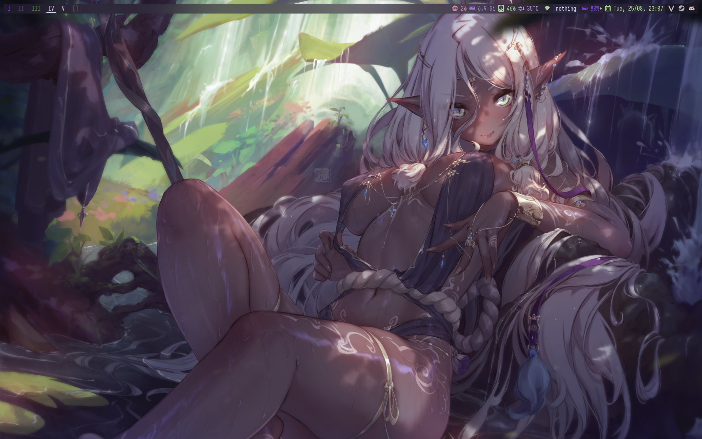
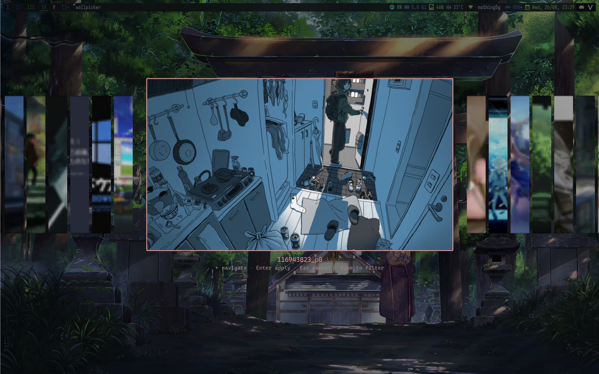
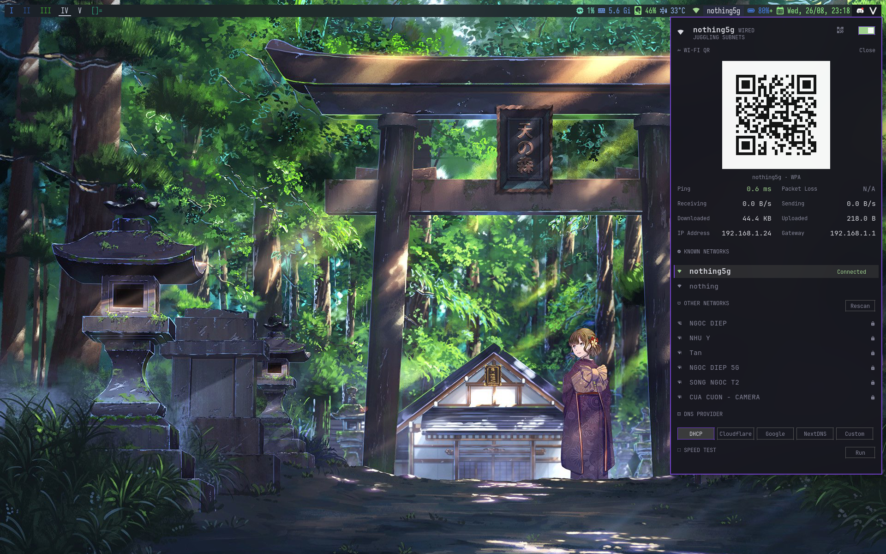

# dwm-dotfiles



Đây là bộ rice mình dùng hàng ngày trên Arch/CachyOS: dwm làm WM, slstatus làm statusbar, cùng một đống script tự viết để mọi thứ ăn khớp với nhau.

## Trong repo có gì

| Thành phần | Làm gì |
|---|---|
| `dwm` | Window manager chính (đã patch sẵn: vanitygaps, movestack, shiftview, cfactor...) |
| `slstatus` | Statusbar: số update, CPU/RAM/disk/nhiệt độ, icon mạng, Wi-Fi mini, pin, giờ |
| `st` | Terminal |
| `slock` | Lock screen |
| `netpanel` | Bấm icon Wi-Fi trên bar là ra panel: chọn mạng, giữ band, chia sẻ mật khẩu bằng QR |
| `dmenu` | Launcher |
| `scripts/` | Toàn bộ "phần mềm giữa": khởi động session, đổi wallpaper + sinh màu, picker ảnh nền, decoder ảnh viết bằng C, wrapper chơi game... |
| `.config/` | Config cho kitty, dunst, fastfetch, fish + starship, picom |

## Cài đặt

### 1. Dependencies (Arch)

```sh
sudo pacman -S --needed base-devel libx11 libxft libxinerama fontconfig freetype \
    harfbuzz imlib2 libjpeg-turbo libwebp feh picom xsettingsd dunst kitty fastfetch fish dash python \
    libnotify polkit-gnome fcitx5 nerd-fonts ttc-iosevka \
    starship networkmanager playerctl libpulse qrencode curl
```

Vài cái đáng nói:

- `starship` — prompt cho fish (config nằm ở `.config/starship.toml`)
- `networkmanager` — cần có để icon Wi-Fi trên bar và netpanel hoạt động
- `playerctl` + `libpulse` — media/volume qua mediacard daemon
- `qrencode` — để netpanel hiện mật khẩu Wi-Fi dạng QR
- `xsettingsd` — daemon XSETTINGS: để app GTK (file dialog, tooltip...) ăn theo theme font/màu tối của hệ thống, không bị "nguyên bản mặc định". Config nằm ở `.config/xsettingsd/`, chạy bằng `xsettingsd -c ~/.config/xsettingsd/xsettingsd.conf`
- `ttc-iosevka` + `nerd-fonts` — font cho bar và terminal
- `libjpeg-turbo` + `libwebp` — chỉ cần khi build `imgdec` (decoder ảnh cho picker, giải thích bên dưới)

Định chơi game trên máy này thì cài thêm: `gamemode gamescope mangohud`.

### 2. Build & install

Clone thẳng vào `~/dwm` nhé — các script và keybind đều hard-code đường dẫn đó:

```sh
git clone https://github.com/slimulv1/dwm-dotfiles.git ~/dwm
cd ~/dwm

sudo make clean install                            # window manager
cd st      && sudo make clean install && cd ..     # terminal
cd slock   && sudo make clean install && cd ..     # lock screen
cd dmenu   && sudo make clean install && cd ..     # launcher
cd slstatus && sudo make install                   # statusbar
cd netpanel && make && cd ..                       # wifi panel (chỉ cần build)

# decoder ảnh cho wallpaper picker
make -f scripts/Makefile.imgdec
```

Ba thứ được build local, không đụng tới root:

- **slstatus** chạy bằng binary trong repo (`~/dwm/slstatus/slstatus`) để khi đổi wallpaper, script tự rebuild và đổi màu nó mà không cần sudo.
- **netpanel** cũng vậy — `netpanel.sh` gọi thẳng binary `~/dwm/netpanel/netpanel`, nên chỉ cần `make` là đủ.
- **imgdec** là binary nhỏ nằm ngay trong `scripts/`. Thiếu nó thì picker vẫn chạy bình thường (tự chuyển sang Pillow/gdk-pixbuf), chỉ là decode chậm hơn một chút thôi.

### 3. Dotfiles

```sh
cp -r ~/dwm/.config/* ~/.config/     # hoặc symlink từng thư mục nếu thích gỡ bỏ dễ
```

> **Firefox transparent chrome (userChrome.css)** nằm riêng ở `.config/firefox/` trong repo —
> copy vào profile Firefox đang dùng, rồi **đổi path @import** cho khớp đường dẫn máy:
>
> ```sh
> # 1. Tìm profile (có chứa chuỗi .default-release, không -back-ovfs)
> ls ~/.config/mozilla/firefox/*.default-release*/
> # 2. Copy 2 file vào thư mục chrome/ của profile đó
> PROFILE=~/.config/mozilla/firefox/<tên-profile>
> mkdir -p "$PROFILE/chrome"
> cp .config/firefox/user.js                     "$PROFILE/"
> cp .config/firefox/chrome/userChrome.css       "$PROFILE/chrome/"
> # 3. Trong userChrome.css, sửa @import trỏ tới màu dwmwal:
> #    ../../../../../.cache/dwmwal/colors.css
> #    (path tính từ chrome/, 5 cấp lên tới ~/ rồi vào .cache/dwmwal/)
> ```
>
> **Cần bật** `browser.tabs.allowTransparentBrowser=true` — file `user.js` tự đặt khi Firefox
> khởi động (userPref). Toàn bộ cấu hình cần thiết đều nằm trong `.config/firefox/user.js`
> (đã copy ở bước 2), gồm:
>
> ```js
> // 1. BẮT BUỘC - bật userChrome.css (nếu tắt, css customize không load)
> user_pref("toolkit.legacyUserProfileCustomizations.stylesheets", true);
> // 2. Cho phép vẽ nền trong suốt (cho tab trong suốt xuyên wallpaper)
> user_pref("browser.tabs.allowTransparentBrowser", true);
> // 3. Tắt theme "Nova" mặc định (nếu để on, nó đè/bao phủ userChrome.css)
> user_pref("browser.nova.enabled", false);
> // 4. Hiện tùy chọn mật độ Compact trong menu Customize toolbar
> user_pref("browser.compactmode.show", true);
> ```
>
> Sau khi copy `user.js` + `userChrome.css` vào profile và **restart Firefox**:
>
> 1. **Kiểm tra CSS hoạt động** — mở `about:config`, xác nhận
>    `toolkit.legacyUserProfileCustomizations.stylesheets` = `true` (nếu vẫn `false`,
>    set thủ công rồi restart).
> 2. **Bật Compact density** (nếu muốn giao diện gọn như thiết kế) — vào
>    **Customize toolbar** (chuột phải thanh tab → Customize), hạ góc phải chọn
>    **Density → Compact**. (Chỉ khi `browser.compactmode.show=true` tùy chọn này mới hiện.)
>
> Sau đó **restart Firefox**. Màu tab/toolbar sync tự động theo wallpaper
> (dwmwal ghi `~/.cache/dwmwal/colors.css` mỗi lần đổi ảnh). Hiệu quả: **tab trong suốt**
> (thấy wallpaper), toolbar + url bar + nội dung vẫn nền đục cho dễ đọc.

### 4. Chạy session

Thêm dòng này vào `~/.xinitrc`:

```sh
exec ~/dwm/scripts/run.sh
```

Lần bấm máy tiếp theo `run.sh` sẽ lo từ A-Z: nạp Xresources, trả lại wallpaper cũ, chạy picom, polkit, fcitx5, slstatus (chết tự sống lại), updater và mediacard, rồi cuối cùng là dwm.

## Đổi wallpaper (và toàn bộ theme)

Bấm **Super + w**: một picker fullscreen kiểu filmstrip mở lên — ảnh đang dùng phóng to ở giữa, mấy ảnh còn lại xếp thành dải mỏng hai bên, trượt mượt theo lúc bạn duyệt.



Chọn xong thì `dwmwal.sh` lo phần còn lại:

1. Lấy palette màu từ chính tấm ảnh (`walgen.py`)
2. Rebuild dwm + sinh lại màu cho slstatus (CPU/RAM/disk/nhiệt độ luôn dùng biến bản sáng hơn cho dễ đọc trên nền tối)
3. Đổi theo màu dunst

Ảnh nền được decode bởi `imgdec` — một chương trình C nhỏ dùng libjpeg-turbo (decode JPEG đúng kích thước cần, không giải mã thừa pixel nào) kèm hỗ trợ WebP. Thumbnail được lưu cache ở `~/.cache/dwmwal/picker/`, nên lần thứ hai mở picker gần như là tức thì.

## Netpanel — quản lý Wi-Fi từ status bar

Bấm icon mạng trên bar: panel Wi-Fi hiện ra bên phải, cho chọn mạng, xem thông số kết nối, chia sẻ mật khẩu bằng QR, đổi DNS, chạy speed test — tất cả viết bằng C + libXft, không cần `nm-connection-editor` hay app nào khác.



## Chơi game

picom đã cấu hình sẵn để nhường đường cho game fullscreen (unredirect), nên phần lớn trường hợp cứ chơi thẳng, mượt. Game nào chạy borderless-window hoặc muốn upscale/ổn định thêm thì dùng wrapper:

```sh
~/dwm/scripts/game.sh <lệnh game>              # gamemode: tăng ưu tiên CPU/GPU khi vào game
~/dwm/scripts/game.sh -g <lệnh game>           # thêm gamescope (compositor riêng cho game)
~/dwm/scripts/game.sh -g -W 2560x1440 <lệnh>   # gamescope + ép độ phân giải ảo
GAME_MANGO=1 ~/dwm/scripts/game.sh <lệnh>      # hiện overlay FPS của mangohud
```

## Keybinds

`MODKEY` = **Super**. Bảng đầy đủ nằm ở [KEYBINDS.md](KEYBINDS.md), còn đây là mấy phím hay dùng nhất:

| Phím | Hành động |
|---|---|
| `Super + Enter` | Mở st |
| `Super + r` | Rofi launcher |
| `Super + j / k` | Focus cửa sổ dưới/trên |
| `Super + Shift + j / k` | Đổi chỗ hai cửa sổ |
| `Super + 1-9` | Chuyển tag |
| `Super + Shift + 1-9` | Đưa cửa sổ sang tag khác |
| `Super + f` | Fullscreen |
| `Super + Shift + Space` | Bật/tắt floating |
| `Super + t` | Về layout tile |
| `Super + w` | Đổi wallpaper + theme |
| `Super + Del` | Khóa máy (slock) |
| `Super + q` | Đóng cửa sổ |

## License

MIT — xem [LICENSE](LICENSE). slstatus/st/slock/dmenu là của [suckless.org](https://suckless.org).
