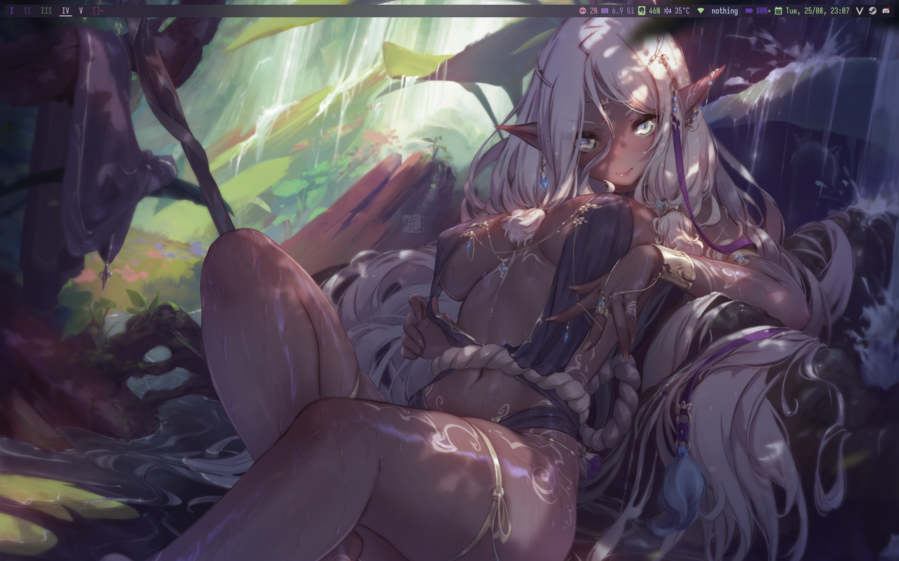
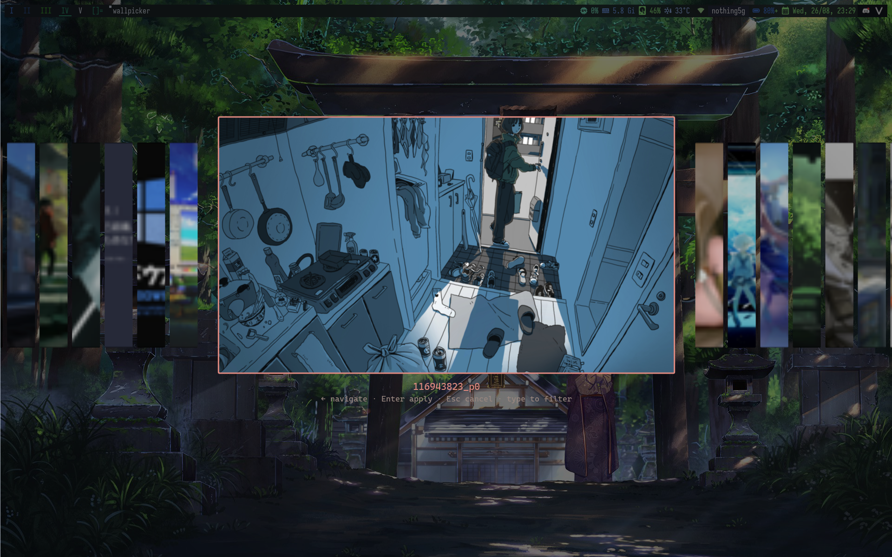
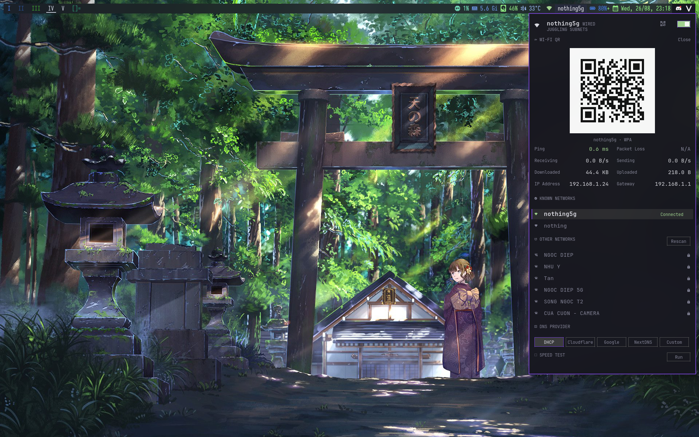
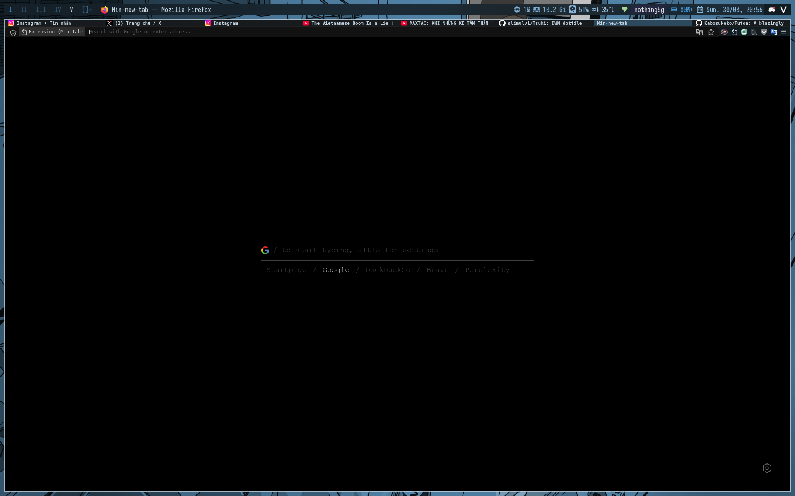

# Tsuki

<p align="center">
  
</p>

<p align="center"><i>
— good evening —<br><br>
One window opens,<br>
the pale moon comes in and stays —<br>
nothing at all moves.<br><br>
Each tile finds its place;<br>
the keyboard speaks, not the hand —<br>
and a color lands.
</i></p>

<p align="center"><sub>月 &nbsp;·&nbsp; <a href="https://dwm.suckless.org/">dwm</a> rice for Arch/CachyOS</sub></p>

## Ảnh

| | |
|---|---|
|  |  |
| Desktop + statusbar | Bấm `Super+w` để đổi wallpaper |
|  |  |
| Netpanel — quản lý Wi-Fi | Giao diện Firefox |

## Cài

Cài Arch/CachyOS **không chọn display manager**, boot vào TTY rồi đăng nhập.

```sh
git clone https://github.com/slimulv1/Tsuki.git ~/tsuki
cd ~/tsuki
./install.sh
```

Lệnh này cài gói phụ thuộc, build `dwm` `st` `slock` `dmenu` `slstatus`, chép
`~/.config` và viết `~/.xinitrc`. Chỉ hỏi mật khẩu khi cần root.

> Tên thư mục **không quan trọng**: `run.sh` và mọi script suy ra vị trí repo từ
> chính `$0` (dùng `$TSUKI_DIR` nếu đã có), nên clone ở `~/Tsuki`, `~/dwm` hay
> chỗ nào cũng chạy. `~/tsuki` chỉ là quy ước của repo này.

Xong thì gõ `dwm`. Thoát về TTY bằng `Super+Ctrl+Q`.

| Phím | |
|---|---|
| `Super+w` | Đổi wallpaper và theme |
| `Super+Shift+R` | Build lại dwm |
| `Super+Ctrl+Q` | Thoát |

Đầy đủ: [KEYBINDS.md](KEYBINDS.md).

Ảnh nền không có sẵn trong repo, trỏ vào ảnh của bạn:

```sh
echo "$HOME/Pictures/Wallpapers/<tên>.jpg" > ~/tsuki/scripts/.wallpaper
```

XLibre thay X.Org được `install.sh` cài tự động ở bản **stable**, không phải làm
gì thêm. Muốn thử bản beta thì chạy thêm `./install.sh xlibre beta` (lệnh này nâng
cấp cả hệ thống). Muốn có màn hình đăng nhập (GDM/SDDM/LightDM) thì
`./install.sh session --dm`.

## Cài tay phần còn lại

`install.sh` sẽ **hỏi** trước khi thêm kho
[arisa](https://github.com/slimulv1/arisa-repo) — kho nhị phân tự dựng bằng
GitHub Actions, không phải kho chính thức. Cần kho đó cho `Super+C`
(`visual-studio-code-bin`) và `Super+D` (`discord-ptb`). Từ chối thì phần còn
lại vẫn cài đủ, chỉ hai phím đó không chạy. Thêm tay bằng `./install.sh arisa`.

## Bộ gõ tiếng Việt

`./install.sh pty` cài `paru` (AUR helper) rồi `fcitx5-lotus-bin`, tạo user
`uinput_proxy`, bật `fcitx5-lotus-server@<bạn>.service`, nạp module `uinput` và
ghi vào `/etc/modules-load.d/uinput.conf` để giữ qua reboot.

Biến môi trường **đã có sẵn** trong `.config/fish/config.fish` và
`scripts/run.sh` — đừng thêm lần nữa. Thêm vào `config.fish` bằng tay sẽ bị
`install.sh dotfiles` ghi đè mất.

Nếu `ibus-daemon` tự quay lại ở lần đăng nhập sau, phải bỏ autostart của
ibus trong desktop environment — `install.sh` chỉ dừng được tiến trình, không
tắt được autostart.

## Tuỳ chọn khác

```sh
sudo pacman -S --needed \
    imagemagick            # ảnh bìa album nhạc .webp -> .png (có guard)
    eza expac neovim hwinfo wget openbsd-netcat jq    # tiện ích cho fish
```

`Super+P` (`epos-gsx300-gui`) là app đi kèm chuột EPOS GSX300, không có trong
kho nào — máy dùng chuột khác thì sửa hoặc xoá dòng `config.h:189`.

---

MIT — [LICENSE](LICENSE). `dwm` `st` `slock` `dmenu` `slstatus` thuộc
[suckless.org](https://suckless.org). Giao diện Firefox:
[Dook97/firefox-qutebrowser-userchrome](https://github.com/Dook97/firefox-qutebrowser-userchrome) (GPL-3.0).
